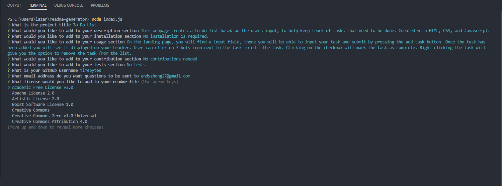

# Readme Generator

## Description

This project was created to help users generate a readme.md file for their projects. This allows developers to spend more time on the project and less on the readme.md file.
This project gave me more practice with the Inquirer and FileSystem modules.
Inquirer is used to prompt the user for input and FileSystem is used to generate the readme.md file.

## Installation

First, download or clone the repository onto local machine.
Using your terminal (vscode/gitbash), navigate to the root folder of this project.
When your at the root folder type in the terminal npm install, this will install all the dependancies needed.
Once that is complete type in the terminal "node index.js" to run the program.

## Usage

When the program is ran, you will be prompted with a series of questions. The answers to these prompts will then be used to create your readme.md file for your project.

The words in white is the prompts from the program, the text in cyan are user inputs.

The last prompt is a list of choices, using the up and down arrow key to navigate and enter to select.

Video walkthrough : https://youtu.be/9orPKzOy6uI

GitHub Repo URL: https://github.com/TimeBytes/readme-generator

## Credits

Used this site to find a list of licenses
https://docs.github.com/en/repositories/managing-your-repositorys-settings-and-features/customizing-your-repository/licensing-a-repository

Used this site to make the badges
https://gist.github.com/lukas-h/2a5d00690736b4c3a7ba

## License

MIT License
